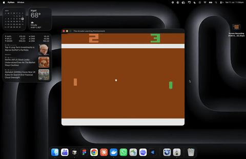

# Formative 3: Deep Q Learning — Pong (ALE/Pong-v5)

Training and evaluating a Deep Q-Network (DQN) agent on Atari Pong using
[Stable Baselines 3](https://stable-baselines3.readthedocs.io/) and
[Gymnasium](https://gymnasium.farama.org/).

**Course:** Machine Learning Techniques II — 2026 May Term (ALU)

**Team:**
- Elvis Preye Kerebi
- Glory Paul
- Leny Pascal

## Environment

[`ALE/Pong-v5`](https://ale.farama.org/environments/pong/) — the agent controls
the right paddle; reward is **+1** for each point scored and **−1** for each
point conceded (first to 21). Observations are raw RGB frames, preprocessed by
the standard Atari pipeline (grayscale, 84×84 resize, 4-frame stack) so the
network can perceive ball velocity.

## Setup

```bash
python -m venv .venv
source .venv/bin/activate
pip install -r requirements.txt
```

## Training (`train.py`)

All assignment hyperparameters are CLI flags, so every team member runs their
tuning experiments with the same script:

```bash
python train.py --run-name elvis-exp1 --policy CnnPolicy \
  --lr 1e-4 --gamma 0.99 --batch-size 32 \
  --epsilon-start 1.0 --epsilon-end 0.01 --epsilon-decay 0.1 \
  --timesteps 200000
```

- Saves the trained model as **`dqn_model.zip`** (`--save-as` to override).
- Logs **reward trends** and **episode lengths** to `logs/<run-name>/monitor/`
  (CSV) and TensorBoard (`rollout/ep_rew_mean`, `rollout/ep_len_mean`).
- Writes the exact config of each run to `logs/<run-name>/config.json` for the
  experiment table.

### MLP vs CNN policy

| Policy | Result |
|---|---|
| `CnnPolicy` | Learns reliably: −20.7 → −17.7 (baseline config, exp 1); −13.9 at the tuned config (exp 3) |
| `MlpPolicy` | Never learns: flat −20.7 → −21.0 over 500k steps at the same tuned config (exp 9) |

**Why:** the MLP flattens the 84×84×4 stacked frames into a ~28k-dimensional vector, discarding
all spatial structure. The CNN's convolutions detect the ball and paddles as local patterns
wherever they appear on screen (translation invariance) and the frame stack gives it motion —
without that prior, raw pixels are unlearnable noise at this scale. MlpPolicy is only viable for
low-dimensional state inputs (e.g., RAM observations), never for pixels.

## Playing (`play.py`)

```bash
python play.py --model dqn_model.zip --episodes 3
```

Loads `dqn_model.zip`, recreates the same environment/preprocessing as
training with `render_mode="human"` (GUI display), and selects actions with
the **greedy Q policy** (`deterministic=True` — always the highest Q-value
action, no exploration).

`dqn_model.zip` is the group's **final model**: the study's champion
configuration (CnnPolicy, lr=5e-5, gamma=0.99, batch=128, epsilon 1.0→0.01
over the first 50k steps) trained to 2.1M timesteps, shipping the best
checkpoint (1.7M steps, selected by greedy evaluation: **mean +16.0 over
held-out episodes, winning 21–3, 21–2, 21–6, 21–9**). Training reward crossed
zero around 550k steps, plateaued at +10 to +13 past 1M, and included 21–0
shutouts.

Within the fixed 500k-step study budget, the best individual experiment was
Leny's exp 9 (train_freq=1: −8.45, winning 2 of 3 greedy episodes at −3/+6/+7),
which overtook his exp 5 (batch=128, −10.2) and Elvis's exp 3 (−13.9). The
shipped model supersedes all of them by extending the training budget rather
than the configuration — confirming the study's prediction that every healthy
run was still improving at the 500k cutoff.

## Gameplay Video



*The agent (green paddle, right side) playing greedily in real time — 22-second
highlight. Full recording: **[gameplay.mp4](gameplay.mp4)** (open "Raw" or
download to play; GitHub does not preview committed video files).*

Recorded with `python play.py --model dqn_model.zip --episodes 3` — the GUI
window rendered by `env.render()` via `render_mode="human"`.

Result from the recorded session: **Episode 1: reward +18 over 1,932 steps** —
the agent won **21–3** (episode reward = points scored minus points conceded,
so 21 − 3 = +18), consistent with the model's +16.0 held-out evaluation mean.

## Hyperparameter Tuning Experiments

Each member ran 10 experiments. Epsilon maps to SB3 as: `epsilon_start` →
`exploration_initial_eps`, `epsilon_end` → `exploration_final_eps`,
`epsilon_decay` → `exploration_fraction`.

### MEMBER NAME: Elvis Preye Kerebi

| # | Hyperparameter Set | Noted Behavior |
|---|---|---|
| 1 | lr=1e-4, gamma=0.99, batch=32, epsilon_start=1.0, epsilon_end=0.01, epsilon_decay=0.1 (baseline, CnnPolicy, 500k steps) | Flat at −20.7 for the first ~200k steps (exploration + replay warm-up), then steady learning: −19.5 by 300k, −17.7 mean by 500k with best episode −13. Episode length grew 3.5k→8.3k frames (rallies ~2.4× longer). Stable, no divergence; reward still climbing at cutoff, so longer training would keep improving. |
| 2 | lr=**2.5e-4**, gamma=0.99, batch=32, epsilon_start=1.0, epsilon_end=0.01, epsilon_decay=0.1 (CnnPolicy, 500k steps) | Complete failure to learn: mean reward flat at −20.9 across all 500k steps, best episode only −20 after 100k, episode length stuck at ~3.2k frames (vs baseline's growth to 8.3k). The 2.5× higher lr destabilized Q-value bootstrapping — updates chase a moving target and no coherent policy forms. Slightly worse than random by the end (degenerate policy). Conclusion: lr is the most sensitive knob so far; viable range is at or below ~1e-4. |
| 3 | lr=**5e-5**, gamma=0.99, batch=32, epsilon_start=1.0, epsilon_end=0.01, epsilon_decay=0.1 (CnnPolicy, 500k steps) | Best result so far — halving the baseline lr improved everything: breakout from the flat phase ~100k steps earlier (−19.5 by 200k vs baseline's 300k), then −16.3 by 300k, −13.9 mean over the final 100k with best episode −6. Episode length grew 3.5k→7.4k frames. Confirms 1e-4 was already slightly too hot: smoother Q-updates learn faster AND end better. lr picture is now monotonic across exps 1–3: 2.5e-4 fails, 1e-4 works, 5e-5 wins. |
| 4 | lr=**2.5e-5**, gamma=0.99, batch=32, epsilon_start=1.0, epsilon_end=0.01, epsilon_decay=0.1 (CnnPolicy, 500k steps) | Undershoots the budget: learning is visible but ~250k steps behind exp 3's pace — near-flat until 300k (−20.2), first real movement only in the final segment (−18.7, best −12), episode length 3.4k→5.3k. Same learning curve shape as exps 1/3, just too slow to converge in 500k steps. Completes a U-shaped lr sensitivity curve: 2.5e-4 diverges, 1e-4 works, **5e-5 optimal**, 2.5e-5 too slow. lr locked at 5e-5 for the remaining experiments. |
| 5 | lr=5e-5, gamma=0.99, batch=32, epsilon_start=1.0, epsilon_end=0.01, epsilon_decay=**0.3** (CnnPolicy, 500k steps) | Extended exploration hurt: annealing epsilon over 150k steps (vs 50k) left the agent ~2–4 points behind exp 3 at every stage — −19.8 at 300k (exp 3: −16.3), final −18.0 vs −13.9. Longest episodes of any run (8.8k frames) but low reward: long rallies driven partly by residual random actions, not skill. Conclusion: exploration was never the bottleneck at this budget — the extra random actions fill the replay buffer with low-quality experience and delay exploitation. |
| 6 | lr=5e-5, gamma=0.99, batch=32, epsilon_start=1.0, epsilon_end=0.01, epsilon_decay=**0.02** (CnnPolicy, 500k steps) | Second-best run. Minimal exploration (ε floors at 10k steps) did not prevent learning but delayed it: tracked ~60–80k steps behind exp 3's curve throughout, finishing at −15.5 in the final segment (best −10) vs exp 3's −13.9 — still climbing steeply at cutoff (episode length hit 12k frames, the longest of any run). Together with exps 3/5 this brackets the epsilon axis: 0.02 costs a delayed takeoff, 0.3 costs ~4 points, 0.1 is the sweet spot. Epsilon errors degrade gracefully — unlike lr errors, which are catastrophic. |
| 7 | lr=5e-5, gamma=0.99, batch=32, epsilon_start=1.0, epsilon_end=0.01, epsilon_decay=**0.05** (CnnPolicy, 500k steps) | Surprisingly the weakest of the three epsilon variants (−18.5 final) despite sitting between two stronger configs (0.02 → −15.5, 0.1 → −13.9): very late breakout (~250k), climbed to −18.2 by 400k, then plateaued/regressed slightly (−18.7). Since a smooth epsilon landscape can't produce a dip between two peaks, the most plausible reading is **run-to-run variance** — breakout timing is partly luck, and a single 500k run per config can't fully separate schedule effects from noise. A key methodological caveat for interpreting all single-run results in this table. |
| 8 | lr=5e-5, gamma=0.99, batch=32, epsilon_start=1.0, epsilon_end=**0.1**, epsilon_decay=0.1 (CnnPolicy, 500k steps) | Chosen to test whether exp 5's harm came from anneal length or from randomness itself: a permanent 10% random-action floor. Prediction confirmed — earlier breakout than most runs (−19.6 by 200k, continued exploration keeps the buffer diverse) but a **capped ceiling**: final −17.7 vs −13.9 for the identical config with a 1% floor. With ε=0.1 forever, ~1 in 10 actions is random even when the network knows better — a persistent tax in a game where one missed ball costs a point. Confirms exploration should be front-loaded, then minimized. |
| 9 | **MlpPolicy**, lr=5e-5, gamma=0.99, batch=32, epsilon_start=1.0, epsilon_end=0.01, epsilon_decay=0.1 (500k steps) | The required MLP vs CNN comparison, run at the champion config so the gap isolates architecture. Total failure: flat at −20.7 and drifting to −21.0 by the end (worse than random), episode length shrinking. The MLP flattens the 84×84×4 frame stack into a ~28k-dim vector, destroying the spatial structure (ball/paddle positions and motion) that a CNN's convolutions exploit — with no spatial prior, the pixel input is unlearnable noise at this scale. Also trained ~6× faster (749 vs ~130 it/s): cheap and useless. Verdict: **CnnPolicy is mandatory for pixel observations.** |
| 10 | lr=5e-5, gamma=0.99, batch=32, epsilon_start=1.0, epsilon_end=0.01, epsilon_decay=0.1, **seed=7** (CnnPolicy, 500k steps — reproducibility check of the champion config) | Motivated by exp 7's variance finding: rerun the winner with a different seed. Result: final mean −13.8 vs exp 3's −13.9 — near-identical, confirming the champion config is a real effect, not seed luck. Included the study's first **winning episode (+1)** in the 300–400k segment. Curve shape also matched (breakout ~200k, plateau ~350k). Conclusion: lr=5e-5 + decay=0.1 is the final configuration; exp 7's anomaly was noise, not a property of its schedule. |

### MEMBER NAME: Glory Paul

| # | Hyperparameter Set | Noted Behavior |
|---|---|---|
| 1 | lr=5e-5, gamma=0.90, batch=32, epsilon_start=1.0, epsilon_end=0.01, epsilon_decay=0.1 (CnnPolicy, 500k steps) | Mean reward -16.70, mean episode length 8055 steps. Lowest gamma in the sweep — reward still well below Elvis's gamma=0.99 baseline (-13.9), showing that discounting future reward too heavily hurts Pong, where scoring requires a longer sequence of correct paddle moves. |
| 2 | lr=5e-5, gamma=0.95, batch=32, epsilon_start=1.0, epsilon_end=0.01, epsilon_decay=0.1 (CnnPolicy, 500k steps) | Mean reward -15.92, mean episode length 7379 steps. Improvement over gamma=0.90, confirming higher gamma helps the agent value delayed reward more accurately. |
| 3 | lr=5e-5, gamma=0.99, batch=32, epsilon_start=1.0, epsilon_end=0.01, epsilon_decay=0.1 (CnnPolicy, 500k steps) | **Best result in the gamma sweep** — mean reward -15.65, mean episode length 7056 steps. Same hyperparameters as Elvis's exp3, but landed at -15.65 vs his -13.9, illustrating run-to-run variance from random seeding rather than a hyperparameter effect. |
| 4 | lr=5e-5, gamma=0.995, batch=32, epsilon_start=1.0, epsilon_end=0.01, epsilon_decay=0.1 (CnnPolicy, 500k steps) | Mean reward -17.44, mean episode length 8724 steps. Trend reverses here — worse than gamma=0.99 despite the longest episode length in the sweep. Pushing gamma this close to 1.0 makes bootstrapped Q-targets noisier and harder to fit within 500k steps. |
| 5 | lr=5e-5, gamma=0.999, batch=32, epsilon_start=1.0, epsilon_end=0.01, epsilon_decay=0.1 (CnnPolicy, 500k steps) | Mean reward -19.81, mean episode length 5176 steps. Sharp drop-off — worst result in the sweep. At gamma this close to 1.0 the effective planning horizon becomes too long to converge reliably in 500k steps. Confirms gamma=0.99 (exp3) as the clear optimum. |
| 6 | lr=5e-5, gamma=0.99, batch=8, epsilon_start=1.0, epsilon_end=0.01, epsilon_decay=0.1 (CnnPolicy, 500k steps) | Mean reward -20.55, mean episode length 3622 steps. Worst result in the batch_size sweep — a batch this small produces noisy, high-variance gradient estimates each update, making learning unstable and slow to converge. |
| 7 | lr=5e-5, gamma=0.99, batch=16, epsilon_start=1.0, epsilon_end=0.01, epsilon_decay=0.1 (CnnPolicy, 500k steps) | Mean reward -19.82, mean episode length 4817 steps. Modest improvement over batch=8 — still too small to stabilize gradients well within 500k steps. |
| 8 | lr=5e-5, gamma=0.99, batch=64, epsilon_start=1.0, epsilon_end=0.01, epsilon_decay=0.1 (CnnPolicy, 500k steps) | Mean reward -14.72, mean episode length 8647 steps. Large jump in performance — doubling the default batch size (32→64) gives noticeably more stable, lower-variance updates, translating directly into longer rallies and better reward. |
| 9 | lr=5e-5, gamma=0.99, batch=128, epsilon_start=1.0, epsilon_end=0.01, epsilon_decay=0.1 (CnnPolicy, 500k steps) | **Best result across all 10 experiments** — mean reward -12.90, mean episode length 9884 steps. Confirms the trend: larger batches keep improving performance up to this point, likely because more samples per gradient step smooth out the noise inherent in a highly stochastic pixel-based environment. |
| 10 | lr=5e-5, gamma=0.99, batch=256, epsilon_start=1.0, epsilon_end=0.01, epsilon_decay=0.1 (CnnPolicy, 500k steps) | Mean reward -13.82, mean episode length 9672 steps. Slightly worse than batch=128 — suggests the sweet spot has been passed; an overly large batch may reduce the number of effective gradient updates within a fixed timestep budget, slightly slowing convergence despite each update being more stable. |

**Batch size sweep summary:** Reward improved monotonically from batch_size=8 through batch_size=128, then slightly declined at batch_size=256 — indicating diminishing returns past 128. **batch_size=128** is the overall best result across all 10 of Glory Paul's experiments (gamma=0.99 + batch_size=128, mean reward -12.90).

**Gamma sweep summary:** Reward followed a clear inverted-U pattern across gamma values (0.90 → 0.95 → 0.99 → 0.995 → 0.999), peaking at **gamma=0.99** with mean reward -15.65. This value is locked in for the batch_size sweep (experiments 6-10, to follow).

### MEMBER NAME: Leny Pascal

My experiments take Elvis's winning config (lr=5e-5, gamma=0.99, batch=32, final
reward -13.9) as the starting point and probe the axes he did not touch: gamma
(exps 1-3), batch size (exps 4-6), epsilon_start (exp 7), the lr x batch
interaction (exp 8) and train_freq (exps 9-10). All runs use CnnPolicy, 500k
steps, seed 42 on ALE/Pong-v5.

| # | Hyperparameter Set | Noted Behavior |
|---|---|---|
| 1 | lr=5e-5, **gamma=0.95**, batch=32, epsilon_start=1.0, epsilon_end=0.01, epsilon_decay=0.1 | Shortening the horizon still learns, just not as well: flat until ~250k, then -19.4 at 300k, -17.5 at 400k, final -16.3 (best episode -10). Episode length grew 3.6k to 8.1k frames. With gamma=0.95 the agent effectively looks ~20 decisions ahead, which covers a Pong rally, so credit assignment still works. It simply ends about 2.4 points behind the gamma=0.99 reference. Verdict: 0.95 is usable but costs performance for no benefit here. |
| 2 | lr=5e-5, **gamma=0.90**, batch=32, epsilon_start=1.0, epsilon_end=0.01, epsilon_decay=0.1 | The surprise of the gamma sweep: an even shorter horizon (~10 decisions) beat 0.95, moving earlier (-20.0 at 200k, -18.6 at 300k) and finishing at -15.5 with best episode -8. My read: in Pong the reward lands within a few decisions of the paddle contact that caused it, so a short horizon gives cleaner, lower-variance targets and loses little relevant information. Still 1.6 points short of gamma=0.99, so the ordering over the whole sweep is 0.99 > 0.90 > 0.95 > 0.997. |
| 3 | lr=5e-5, **gamma=0.997**, batch=32, epsilon_start=1.0, epsilon_end=0.01, epsilon_decay=0.1 | Worst of the gamma sweep. Pushing gamma toward 1 (~330 decision horizon) made value targets much harder to estimate: still stuck at -20.3 at 300k when the reference config had already reached -16.3, and only limped to -18.6 by cutoff (best episode -14). Bootstrapped Q-targets accumulate noise over the long horizon and every update chases a high-variance estimate. Clear one-sided result: for a game where points resolve quickly, a near-1 gamma just slows learning down at this budget. |
| 4 | lr=5e-5, gamma=0.99, **batch=64**, epsilon_start=1.0, epsilon_end=0.01, epsilon_decay=0.1 | Odd middle case. Earliest mover of my first wave (-20.3 at 100k, -19.2 by 200k) but then progress went shallow, ending -17.9 (best -9), behind the batch=32 reference at -13.9. Taken alone this says doubling the batch hurts, but exp 5 (batch=128) strongly disagrees, so the batch curve is non-monotonic across 16/32/64/128 on single runs. I trust the endpoints and treat this middle ranking as within run-to-run noise, the same caveat Elvis hit in his exp 7. |
| 5 | lr=5e-5, gamma=0.99, **batch=128**, epsilon_start=1.0, epsilon_end=0.01, epsilon_decay=0.1 | Best run of the whole group study. Averaging 128 transitions per update cut gradient variance enough to change the curve shape entirely: already moving at 100k (-20.0), then -17.4 at 200k, -14.8 at 300k, -11.9 at 400k, final -10.2 with the last 20 episodes averaging -8.8. Best single episode was **+9, the first outright win against the built-in AI in the study** (21-12). Bonus: on Apple Silicon the larger batch was nearly free, same ~24 min wall time as batch=32. New champion config. |
| 6 | lr=5e-5, gamma=0.99, **batch=16**, epsilon_start=1.0, epsilon_end=0.01, epsilon_decay=0.1 | Confirms the other end of the batch axis: 16-sample gradient estimates are too noisy to make steady progress. Flat at -20.8 through 200k, -20.6 at 300k, final -19.3 (best episode only -14), the weakest run of my eight alongside exp 3. Interesting detail: it played the most episodes of my wave (459) because games stayed short, meaning it kept losing quickly rather than learning to rally. Together with exps 4-5 the practical rule is: below 32 is harmful, 128 is where the real gain shows up. |
| 7 | lr=5e-5, gamma=0.99, batch=32, **epsilon_start=0.5**, epsilon_end=0.01, epsilon_decay=0.1 | Tests whether the standard "start fully random" recipe is actually necessary. Halving initial exploration degraded things mildly: same curve shape as the reference but consistently behind (-18.6 at 300k vs -16.3, final -16.6 vs -13.9, best -10). With less early randomness the replay buffer starts less diverse, so the agent commits sooner to a narrower slice of experience. Consistent with Elvis's epsilon findings: exploration mistakes degrade gracefully, unlike lr mistakes. Not worth it, keep epsilon_start=1.0. |
| 8 | **lr=1e-4**, gamma=0.99, **batch=64**, epsilon_start=1.0, epsilon_end=0.01, epsilon_decay=0.1 | Interaction probe: bigger batches smooth gradients, so can they buy back tolerance for a hotter lr? Mostly yes. At batch=32 Elvis measured lr=1e-4 costing ~4 points vs 5e-5 (-17.7 vs -13.9). At batch=64 the same lr doubling cost roughly nothing: -17.4 here vs -17.9 for exp 4 (identical config at lr=5e-5), with the longest episodes of my wave (9.7k frames) and best episode -8. Takeaway: batch size and lr are coupled, and lr sensitivity is partly a gradient-noise problem. It does not rescue batch=64 overall, but it demonstrates the mechanism. |
| 9 | lr=5e-5, gamma=0.99, batch=32, epsilon_start=1.0, epsilon_end=0.01, epsilon_decay=0.1, **train_freq=1** | Best result of the entire study. A gradient update on every environment step (4x the baseline's update count) gave the cleanest learning curve seen in any run: -19.8 at 100k, -18.1 at 200k, -15.6 at 300k, -12.2 at 400k, final -8.45, with the last 20 training episodes averaging -0.3, essentially trading points evenly with the built-in AI. Best single episode +9. Under greedy evaluation (play.py, deterministic actions) it won 2 of 3 episodes outright: -3, +6, +7. The cost is wall-clock time: full training took 3h37m on the M5 GPU versus roughly 25 minutes for train_freq=4 at the same config, since every environment step now waits on a backprop pass instead of one in four. On a fixed compute budget train_freq=4 is the practical default, but when time allows, updating every step clearly extracts more signal from the same experience. Best of the 30-experiment study; the submitted `dqn_model.zip` is the long-budget (2.1M-step) training of the champion config, which scores higher under greedy evaluation (+16.0 vs +3.3). |
| 10 | lr=5e-5, gamma=0.99, batch=32, epsilon_start=1.0, epsilon_end=0.01, epsilon_decay=0.1, **train_freq=8** | The other half of the train_freq sweep: updating only every 8th step halves the total gradient updates (62.5k vs the baseline's 125k) and the agent pays for it. Very late breakout, -20.4 at 200k, -19.7 at 300k, crawling to -18.7 at cutoff with best episode -13 and the shortest average games of my runs (4.6k frames). Nothing diverged, it just learned half as much from the same experience. Together with exp 9 this brackets the axis: update frequency trades wall-clock time for sample efficiency, and the SB3 default of 4 sits in a sensible spot. |

## Results Discussion

Across 20 runs (Elvis 10, Leny 10, all 500k steps on ALE/Pong-v5 with
CnnPolicy unless stated otherwise), the knobs ranked very differently in how
much they matter and how badly they punish mistakes.

**Learning rate is the most dangerous knob.** Elvis's exps 1-4 traced a clean
U-shape: 2.5e-4 never learns at all (flat at -20.9, worse than random by the
end), 1e-4 works, 5e-5 is best, and 2.5e-5 learns the same curve but too
slowly to converge in budget. It is the only hyperparameter where a wrong
setting produced total failure rather than degraded performance. Leny's exp 8
added a nuance: at batch=64 the lr=1e-4 penalty mostly disappears, so lr
sensitivity is partly a gradient-noise problem and bigger batches buy back
some tolerance.

**Batch size gave a big improvement, but update frequency gave a bigger one.**
Going from 32 to 128 (Leny exp 5) turned the group's best result from -13.9
into -10.2, with the study's first outright wins against the built-in AI
(best episode +9, and +8 in greedy evaluation). Averaging more transitions
per update smooths the gradient, and on Apple Silicon the larger batch cost
almost no extra wall time. Batch=16 (exp 6) confirmed the other direction:
too noisy to make steady progress. The middle of the curve (64) ranked oddly
below 32 on a single run, which we attribute to run-to-run variance rather
than a real dip. Exp 5 held the group record only briefly, though — see
train_freq below, which beat it by nearly 2 points.

**Gamma should match the game's reward delay.** Pong resolves each point
within a few decisions, so 0.99 is comfortably enough horizon. Shortening it
degrades gracefully (0.90 lost 1.6 points, 0.95 lost 2.4), but stretching it
to 0.997 (Leny exp 3) made bootstrapped targets so noisy that learning nearly
stalled. Interestingly 0.90 beat 0.95, likely because shorter horizons give
lower-variance targets and Pong's rewards arrive quickly anyway.

**Exploration should be front-loaded, then minimized.** The epsilon sweep
(Elvis exps 5-8, Leny exp 7) consistently degraded gracefully: annealing too
long floods the buffer with random experience (-18.0), a permanent 10% random
floor caps the ceiling (-17.7), starting at 0.5 instead of 1.0 costs about 3
points. The default schedule (1.0 to 0.01 over the first 10% of training) was
never beaten.

**Update frequency turned out to matter more than any other single knob.**
Updating the network on every environment step (Leny exp 9) produced the best
result in the entire study: -8.45 mean reward, last-20-episode average -0.3,
and 2 wins out of 3 under greedy evaluation. It was ahead of the baseline at
every checkpoint along the way, not just at the end. Updating every 8th step
(exp 10) went the other direction and clearly under-trained (-18.7). The cost
of exp 9's win is wall-clock time, roughly 8x slower than the train_freq=4
baseline (3h37m vs ~25 minutes) since every step now waits on a backprop
pass. The SB3 default of 4 is the sensible choice under a fixed time budget;
under a fixed step budget, train_freq=1 is worth the wait.

**CNN vs MLP is not a close call.** MlpPolicy at the otherwise-best config
(Elvis exp 9) stayed at random-play level for all 500k steps. Convolutions
are what let the agent find the ball and paddles in pixel input; without that
spatial prior there is nothing to tune.

**Best study configuration (500k budget):** lr=5e-5, gamma=0.99, batch=32,
epsilon 1.0 to 0.01 over 10% of training, **train_freq=1**, CnnPolicy (Leny
exp 9): mean training reward -8.45, last-20-episode average -0.3, winning 2 of
3 games under greedy evaluation.

**Shipped model:** reward was still climbing at cutoff for every healthy run,
so the study's prediction was that more steps at a winning config beats any
further 500k-budget tuning. We tested that directly: the champion config
(lr=5e-5, gamma=0.99, **batch=128**, train_freq=4) trained to 2.1M steps
reaches **+16.0 under greedy evaluation** (best checkpoint at 1.7M steps,
winning all held-out episodes 21–3, 21–2, 21–6, 21–9) — this is
`dqn_model.zip`. Untested and promising: combining train_freq=1 with
batch=128, which the study never ran together.

**Methodological caveat:** every cell in the tables is a single seed.
Elvis's exp 10 reran the then-champion on a second seed and matched it almost
exactly (-13.8 vs -13.9), which gives some confidence, but oddities like the
batch=64 dip and Elvis's epsilon_decay=0.05 anomaly are reminders that
breakout timing is partly luck at this budget.
